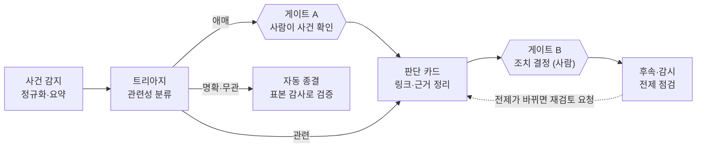
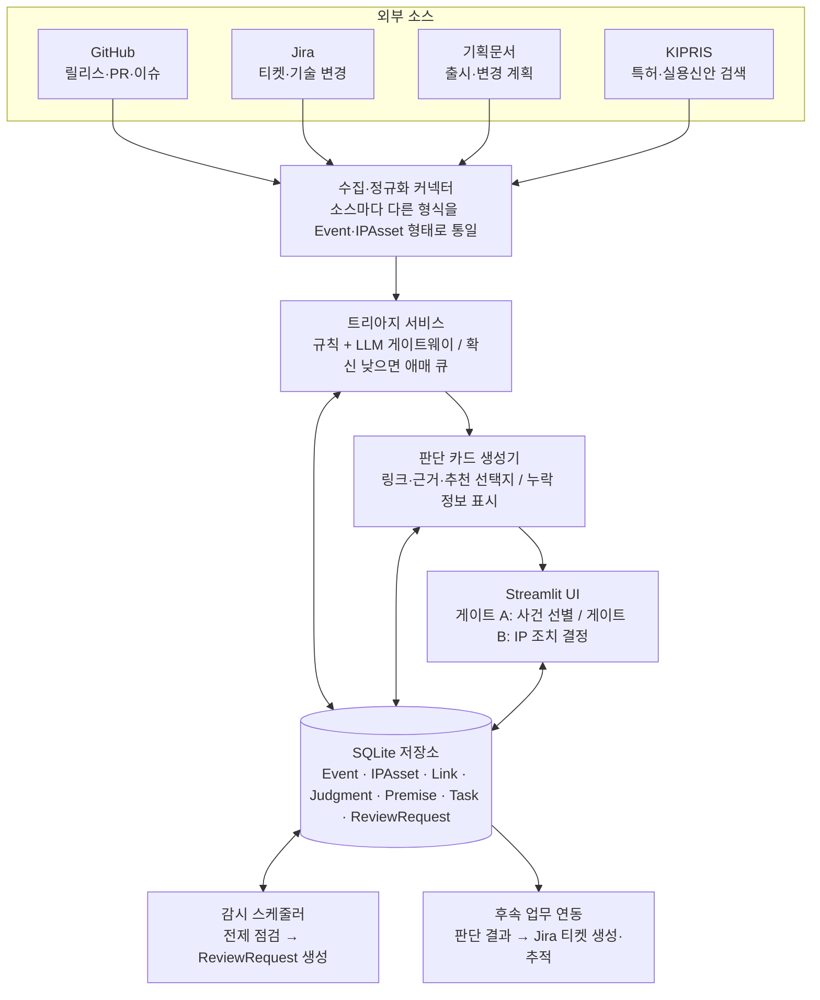

# 사람 판단 중심 IP 업무 자동화 — 프로젝트 설계서

2026-09-30 · 민규

사건이 발생하면 관련 IP를 걸러 판단 카드를 만들고, 사람의 판단을 이유·전제와 함께 저장하며, 전제가 바뀌면 재검토를 요청하는 시스템의 설계를 정의한다.

## 개요와 설계 원칙

현재 프로토타입은 KIPRIS 검색, 키워드 점수, 사람 판단 기록까지 구현되어 있다. 이 설계서는 이를 사건 기반 파이프라인으로 확장하면서 코드 리뷰에서 나온 문제 27건을 해소하는 구조를 정의한다.

### 목적과 범위

- **목적**: IP 업무에서 사람의 판단 전후에 반복되는 작업(자료 준비, 판단 기록, 후속 연결, 재검토)을 자동화한다. 최종 판단은 사람이 한다.
- **범위**: 사건 감지, 트리아지, 판단 카드 생성, IP 조치 결정 기록, 후속 업무 연결, 전제 감시와 재검토 요청.
- **범위 밖**: 선행특허 여부·등록 가능성·침해 여부 같은 법률 판단 자체, 출원서 작성, 변리사 업무의 대체.

### 설계 원칙

1. **최종 판단은 사람이 한다.** AI는 분류, 근거 제시, 요약만 한다. 모든 추천은 법률 자문이 아니다.
2. **판단은 이유와 전제와 함께 저장한다.** 전제는 감시할 수 있는 항목으로 쪼개서 저장한다.
3. **재검토는 전제의 변화로 시작한다.** 사람이 다시 검색해야만 시작되는 구조를 쓰지 않는다.
4. **실제 데이터만 쓴다.** 가짜 특허 데이터를 만들지 않고, 데모도 공개 데이터로 구성한다.
5. **근거를 남긴다.** 모든 분류와 추천에 원문 인용과 사용한 모델·프롬프트 버전을 붙이고, 판단 기록은 append-only로 유지한다.

## 대상 범위와 사건 유형

판단 대상은 내부 사건이 자사 IP에 주는 영향이고, KIPRIS는 유사 특허를 찾는 비교 코퍼스로 쓴다. 사건 유형마다 사람이 답해야 하는 질문이 다르고, 이것이 곧 판단 시점을 정한다.

| 사건 유형 | 감지 신호 | 사람이 답할 질문 |
| --- | --- | --- |
| 제품·기술 출시 | GitHub 릴리스·태그, Jira epic 상태 변경 | 새로 출원할 만한 것이 있는가? 타사 특허와 부딪힐 가능성은? |
| 논문·오픈소스 공개 | 공개 예정일, 공개 대상 레포·커밋 | 공개 전에 출원해야 하는가? 공개 후에는 신규성을 잃을 수 있어 시점이 핵심이다(국가별 예외 규정이 다르므로 담당자·변리사 확인 필요) |
| 기술 변경 | 기획문서 변경, 주요 PR 병합 | 기존 IP의 범위를 벗어났는가? 보강·유지·정리 중 무엇인가? |
| 외부 특허 신규 공개 | KIPRIS 주기 조회(관심목록) | 이 특허가 기존 판단의 전제를 바꾸는가? |

### IP 대상의 두 종류

- **자사 IP(기준 대상)**: 판단의 주체가 되는 기존 IP 기록이다. Link로 제품·모듈·레포·Jira·담당자와 연결된다.
- **외부 특허(비교 대상)**: KIPRIS Plus에서 조회한 유사·저촉 후보다. 판단 카드의 근거로 쓰이고, 사람이 확정한 건 관심목록에 올라간다.

## 전체 구조

### 처리 흐름

사건은 감지·정규화 → 트리아지 → 판단 카드 → 조치 결정 → 후속·감시 순으로 흐른다. 사람이 개입하는 곳은 트리아지 뒤에서 애매한 사건을 확인하는 **게이트 A**와, IP 조치를 결정하는 **게이트 B** 두 곳이다. 명확하게 무관한 사건은 자동 종결하되 표본 감사로 검증하고, 저장된 전제가 바뀌면 재검토 요청이 판단 카드로 되돌아온다.

### 시스템 구성

소스별 커넥터가 형식을 통일해 저장소에 넣고, 트리아지·카드 생성·UI가 모두 저장소를 읽고 쓴다. 감시 스케줄러와 후속 업무 연동도 저장소를 기준으로만 움직여서, 어느 단계의 결과든 나중에 같은 곳에서 추적할 수 있다.

재검토 요청은 저장소를 거쳐 UI의 판단 카드로 돌아온다.

## 단계별 상세 설계

각 단계는 입력, 처리, 출력, 사람 개입 여부를 정해 둘 때 다른 단계와 독립적으로 구현·테스트할 수 있다.

### 사건 감지·정규화

- **커넥터**: GitHub(릴리스·태그·PR 병합), Jira(epic 상태·필드 변경), 기획문서(버전·해시 변경), 공개 일정(논문·오픈소스 공개 예정일). 웹훅 또는 주기 폴링으로 수집한다.
- **정규화**: 모든 사건을 Event(유형, 출처, 발생 또는 예정 시각, 원문 참조)로 통일한다. 출처별 고유 ID로 중복 수신을 막는다.

### 트리아지

사건과 후보 IP(자사 IP, KIPRIS 유사 특허)를 받아 네 가지 신호로 판정한다. IPC 분류가 주 신호이고, 개념 키워드, 임베딩 유사도, LLM 구조화 판정이 보조 신호다. 출력은 세 갈래다.

- **무관**: 자동 종료하고 로그를 남긴다. 주기적으로 샘플링해 사람이 검수한다.
- **관련**: 판단 카드 생성으로 바로 간다.
- **애매**: 게이트 A로 보내 사람이 검토 여부를 정한다.

"애매"는 LLM 확신도 하나로 정하지 않고, 다음 중 하나라도 해당하면 애매로 라우팅한다.

1. 신호 불일치: 임베딩 유사도는 높은데 LLM은 무관으로 판정
2. 확신도가 중간대
3. 필수 정보 누락: 공개일, 청구항, 버전 등
4. 고위험 사건 유형: 공개 예정, 등록 IP 변경은 항상 사람
5. 과거 판단과 충돌

LLM 분류는 few-shot 프롬프트로 시작하고, 출력은 구조화 JSON(label, confidence, evidence 원문 인용, missing_info)으로 고정한다. 사람이 남긴 판단 로그가 프롬프트 예시와 평가셋이 된다.

### 후보 수집 (KIPRIS)

- 검색어는 사건에서 추출한 기술어로 구체화하고, 다중 쿼리와 페이지네이션으로 후보 풀을 20건 이상으로 넓힌다.
- 통신은 HTTPS(지원 여부 확인 후)로 하고, 응답의 HTTP 상태·successYN·resultCode를 검사해 키 오류·쿼터·네트워크를 구분한 예외로 올린다. 결과 없음과 오류를 혼동하지 않는다.

### 판단 카드

- 사건 요약과 원문 링크
- 관련 IP 후보와 연관 근거 원문 인용. 연관 후보는 임베딩이 제안하고 사람이 확정해 Link로 저장한다.
- 과거 결정과 유사 사례
- 누락된 정보와 사람이 확인할 질문
- 추천 조치(정해진 목록에서만 선택): 신규 출원 검토, 기존 IP 보강 검토, 유지, 정리 검토, 타사 특허 확인 필요
- 추천은 법률 자문이 아니라는 문구와 사용한 모델·프롬프트 버전

### IP 조치 결정 (게이트 B)

저장 전에 다음을 검증한다.

- **결정**: 추천 목록 중 하나 또는 사람이 직접 지정한 조치
- **이유(필수)**: 선택형 사유와 자유 서술. 공백은 저장하지 않는다.
- **전제(1개 이상)**: 카드가 감시 항목 후보를 제안하고 사람이 확정한다.
- **담당자와 재검토 기한**

저장은 append-only로 하고, 저장 후 폼을 초기화하며 같은 내용의 중복 저장을 막는다.

### 후속 업무·전제 감시·재검토

- **후속 업무**: 결정이 저장되면 Jira 티켓을 생성하고 참조를 Task에 저장해 상태를 추적한다.
- **전제 감시**: 출처별 워처(GitHub 커밋, Jira 필드, KIPRIS 재조회, 문서 해시)가 주기적으로 기대값과 비교한다. 출원인·IPC 같은 목록은 순서와 무관하게 집합으로 비교한다.
- **관심목록**: 판단한 외부 특허는 출원번호로 직접 재조회한다. 사람이 다시 검색하지 않아도 변화가 감지된다.
- **재검토 트리거**: 전제 값 변경, 전제 출처 소실, 새로 공개된 유사 특허 출현, 재검토 기한 경과.
- **재검토 요청**: 이전 판단과 변경 내용(diff)을 담은 ReviewRequest를 만들어 판단 카드 단계로 되돌리고, 게이트 B에서 새 판단을 기록한다. 확인 완료 상태를 두어 같은 경고가 반복되지 않게 한다.

## 데이터 모델

모든 데이터는 SQLite 한 파일에 저장한다(JSON 파일 append 방식 폐기). 판단·전제 기록은 수정·삭제하지 않고 **새 행을 추가하는 방식(append-only)**으로만 쌓는다. 정정이 필요하면 이전 행을 가리키는 새 행을 추가한다.

| 객체 | 역할 | 핵심 필드 |
| --- | --- | --- |
| Event | 감지된 사건 1건 | id, 유형(출시·출간·논문·오픈소스 공개·기술 변경), 출처(GitHub/Jira/기획문서 등), 원문 링크, 감지 시각, 정규화 요약, 상태(신규·트리아지 완료·종결) |
| IPAsset | 자사 IP 또는 외부 특허 1건 | 출원번호, 구분(자사/외부), 명칭, 출원인, IPC 집합, 법적 상태, 원문 URL, 마지막 조회 시각 |
| Link | 사건·IP·실무 작업 사이의 연결 | id, 출발 객체, 도착 객체, 연결 근거(IPC 일치·키워드·담당자 지정·LLM 제안), 신뢰도 구간, 확인자(사람 확인 여부) |
| Judgment | 사람의 IP 조치 결정 1건 | id, 저장 키(출원번호 + 검토 기술), 사건 ref, 검색어, 분석 모드, 결정(제한된 선택지), 사유(필수), 전제 refs, 담당자, 기한, 모델·프롬프트 버전, 생성 시각, 이전 판단 ref |
| Premise | 판단이 기대고 있는 전제 | id, 판단 ref, 출처, 확인 키, 기대값, 확인 방법, 마지막 확인 시각, 상태(유지·변경·확인 불가) |
| Task | 판단에서 나온 후속 업무 | id, 판단 ref, 제목, 담당자, 기한, 외부 티켓 링크(Jira 등), 상태 |
| ReviewRequest | 재검토 요청 | id, 원 판단 ref, 트리거 전제 ref, 변경 내용 요약, 상태(대기·처리 중·완료·기각), 새 판단 ref |

### 설계 규칙

- **판단 저장 키는 (출원번호, 검토 기술)**이다. 같은 특허라도 검토하는 기술이 다르면 별개의 판단이며, 같은 키의 재판단은 이전 판단 ref로 이어 붙인다.
- **사유는 필수, 전제는 1개 이상 필수**로 한다. 비어 있으면 저장 버튼을 막는다(게이트 B).
- **결정값은 열거형**으로 제한한다: 신규 출원 검토 / 기존 IP 보강 검토 / 유지 / 정리 검토 / 타사 특허 확인 필요. 자유 서술은 사유 칸에만 쓴다.
- 비교는 **집합 비교**(IPC·출원인)로 하고, 필드는 인덱스가 아니라 상수 이름으로 접근한다.
- 저장 후에야 입력 폼을 초기화하고(저장 후 초기화), 같은 판단의 중복 저장은 키와 시각으로 막는다.
- 이전 `judgments.json`은 1회 마이그레이션 스크립트로 Judgment 행에 옮기되, 없는 필드(검토 기술·검색어 등)는 "이전 데이터"로 표시해 비워 둔다.

## 검색·점수 설계

현재 프로토타입은 검색어 1개로 최대 20건만 가져와 점수를 매기므로, 후보를 놓치거나 점수를 과신하기 쉽다. 아래처럼 바꾼다.

### 후보 수집

- **다중 검색어 + 페이지 넘김**: 사건에서 뽑은 기술 용어를 여러 검색어로 나누어 조회하고, 한 검색어당 여러 페이지를 받아 후보 풀을 만든다. 출원번호로 중복을 제거한다.
- **API 응답 검증**: HTTP 상태, `successYN`, `resultMsg`를 확인하고 실패는 화면과 로그에 그대로 드러낸다. 결과 0건과 호출 실패를 구분한다.
- **감시 목록 조회**: 이미 판단한 특허는 검색어가 아니라 출원번호로 다시 조회해 법적 상태 변화를 확인한다.
- 출원인 기준 조회를 KIPRIS가 지원하는지 먼저 확인한다(자사 IP 포트폴리오 수집의 전제).

### 점수 신호

- **주 신호: IPC 분류.** 열관리 계열은 H01M 10/60~10/667을 중심으로 삼되, 실제 IPC 표와 대조해 확정한 뒤 설정 파일에 넣는다.
- **보조 신호**: 키워드 일치, 임베딩 유사도, LLM 판정. 어느 하나가 단독으로 결론을 내리지 않고, 신호끼리 어긋나면 "애매" 큐로 보낸다.
- **표시는 3단계 구간**(높음·중간·낮음)으로 하고, 100점 만점 숫자는 화면에 내지 않는다. 내부 점수는 정렬에만 쓴다.
- 개념 그룹 방식과 일반 키워드 방식은 임계값(70/40)을 공유하지 않고 각각 따로 정한 뒤, 평가 세트로 조정한다.

### 한국어 처리와 설정 분리

- 조사 제거 규칙 대신 형태소 분석기(예: kiwipiepy)를 쓴다.
- 개념 그룹, 가중치, IPC 규칙은 코드에서 빼서 YAML 설정 파일로 옮긴다. 기술 분야가 바뀌어도 코드를 고치지 않게 한다.
- 점수 규칙을 바꿀 때마다 평가 세트로 회귀 확인을 한다(로드맵 장 참조).

## 비기능 요구사항

### 보안

- KIPRIS가 HTTPS를 지원하면 https로 호출한다. 확인 전에는 접근키가 평문으로 전송된다는 점을 위험으로 기록한다.
- XML 파싱은 `defusedxml`을 쓴다.
- 접근키는 환경 변수로만 받고, 로그·화면·오류 메시지에서는 URL 인코딩된 형태까지 가린다.
- **LLM 사용 정책**: 어떤 데이터(기획문서, 미공개 기술 정보)를 외부 LLM에 보내도 되는지, 전송 경로, 보관 기간, 마스킹 대상을 정하고 문서화한다. 정하기 전에는 공개 자료만 LLM에 보낸다.

### 견고성

- API 오류는 조용히 삼키지 않고 사용자에게 보인다.
- IPC·출원인 비교는 집합 비교로 한다(순서만 달라진 경우 경고하지 않음).
- 저장은 SQLite 트랜잭션으로 하여 동시 저장 시 유실이 없게 한다.
- 후보 중복 제거, 저장 후 폼 초기화, 필드 접근은 인덱스 대신 상수 이름으로 한다.
- LLM 출력은 정해진 JSON 형식으로 받아 검증하고, 형식이 어긋나면 "애매" 큐로 보낸다.

### 개발 환경과 저장소

- Python 버전을 3.12 이상으로 고정하거나, f-string 안의 역슬래시(`app.py:103`, `main.py:437`)를 고쳐 3.11 이하에서도 돌게 한다.
- 의존성 버전을 고정하고, git을 초기화하며 백업 파일을 저장소에서 뺀다.
- 소스의 `\uXXXX` 이스케이프 문자열을 실제 한글로 바꿔 읽고 고칠 수 있게 한다.
- `data/`, `__pycache__`, 접근키 파일의 관리 정책을 `.gitignore`와 README에 적는다.
- README에 실행 방법, 환경 변수, 데이터 스키마, 알려진 한계를 최신 상태로 유지한다.

## 구현 로드맵과 평가 계획

### 단계별 로드맵

| 단계 | 내용 | 산출물 | 완료 기준 |
| --- | --- | --- | --- |
| 0. 정리 | P1 문제 해소: f-string·API 오류 표시·사유 필수·git·한글 문자열 | 정리된 저장소 | 깨끗한 환경에서 실행·저장 확인 |
| 1. 데이터 모델 | SQLite 스키마, 판단 저장 개편(키·사유·전제), JSON 마이그레이션 | DB·마이그레이션 스크립트 | 기존 판단이 손실 없이 이관됨 |
| 2. 수집·순위 | 다중 검색어·페이지네이션, IPC 주신호, 설정 파일 분리, 구간 표시 | 개선된 후보 목록 | 평가 세트에서 지금보다 나아짐 |
| 3. 트리아지·카드 | 사건 입력·정규화, 링크 테이블, LLM 분류, 애매 큐, 판단 카드 생성 | 카드 화면 | 사건 1건이 카드까지 이어짐 |
| 4. 전제 감시·재검토 | 전제 저장·주기 점검, ReviewRequest 생성, 카드로 복귀 | 감시 스케줄러 | 전제 변경 시 재검토 요청 생성 |
| 5. 후속 업무 | Jira 등 티켓 자동 생성·추적 | 연동 커넥터 | 판단에서 티켓이 생성·추적됨 |

### 기존 코드의 새 구조 매핑

| 기존 | 새 위치 |
| --- | --- |
| `main.py` KIPRIS 호출·XML 파싱 | 수집 커넥터 (IPAsset 적재) |
| `main.py` 개념 그룹 점수 | 점수 모듈 + YAML 설정 (보조 신호로 강등) |
| `main.py` CSV·CLI | 유지 (디버깅용) |
| `app.py` 검색 화면 | 후보 목록 화면 |
| `app.py` `save_judgment` | 게이트 B 저장 (Judgment + Premise) |
| `app.py` `compare_with_latest` | 집합 비교 기반 재검토 비교 |
| `data/judgments.json` | SQLite Judgment 테이블 (1회 마이그레이션) |

### MVP: 수직 슬라이스 1개

전 유형을 한 번에 만들지 않고 **"오픈소스 공개" 사건 한 가지**로 처음부터 끝까지 한 바퀴 돌린다. 입력은 공개 GitHub 릴리스와 한 회사의 KIPRIS 출원 목록(포트폴리오 역할)을 쓴다. 사건 → 트리아지 → 카드 → 판단 저장 → 전제 1개 감시 → 재검토 요청까지 이어지면 성공이다.

### 평가 계획

평가 세트는 사람이 직접 라벨링한 **20~50건**으로 만든다. 점수 규칙이나 프롬프트를 바꾸기 전후에 같은 세트로 다시 측정한다.

| 지표 | 의미 |
| --- | --- |
| 분류 정확도 | 사람 판단 대비 트리아지 결과가 맞는 비율 |
| 애매 큐 비율 | 사람에게 넘기는 건의 비율(너무 높으면 자동화 효과 낮음) |
| 재검토 오탐률 | 재검토 요청 중 실제로 필요 없던 비율 |
| 자동 종결 누락률 | 자동 종결된 건을 샘플링 감사해 놓친 비율 |

## 미결정 사항과 리스크

### 팀이 정해야 할 것

- **대상 IP**: 특허만 다룰지, 실용신안·상표·저작권까지 포함할지
- **데모 데이터**: 실제 회사 자료를 쓸지, 공개 데이터로 대체할지
- **평가 방법**: 라벨링을 누가 하고 기준은 무엇인지
- **LLM 경로와 정책**: 외부 API 사용 가능 여부, 보관·마스킹 기준
- **저장소**: SQLite로 충분한지, 여러 명이 동시에 쓰는지
- **일정 대비 범위**: 주어진 시간 안에 로드맵의 어느 단계까지 갈지

### 리스크

| 리스크 | 대응 |
| --- | --- |
| LLM이 그럴듯하지만 틀린 추천을 냄 | 추천은 열거형 선택지로 제한, 근거 인용 필수, 최종 결정은 항상 사람 |
| 자동 종결이 중요한 사건을 놓침(거짓 음성) | 고위험 유형은 자동 종결 금지, 종결 건 샘플링 감사 |
| 법적 표현·책임 문제("침해 없음"처럼 단정) | 화면은 "검토 필요" 수준으로만 표현, 법률 자문을 대체하지 않는다는 문구 표시 |
| 전제 변경 감지 누락·과장 | 전제를 확인 가능한 키로만 등록, 오탐률 지표로 주기 조정 |
| 범위 확대로 완성된 것이 없음 | 수직 슬라이스 1개를 끝까지 돌린 뒤 유형 추가 |