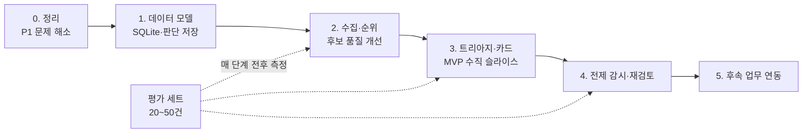

# 프로젝트 진행 파이프라인

사람 판단 중심 IP 업무 자동화 — 설계서의 로드맵을 실제 작업 순서로 풀어 쓴 진행 문서다. 각 단계는 앞 단계의 완료 기준을 통과해야 시작한다. 체크박스는 진행하면서 직접 표시한다.

## 시작 전에 정할 것 (블로커)

이 항목이 정해지지 않으면 해당 단계가 막힌다. 담당자와 기한을 적는다.

| 결정 사항 | 막히는 단계 | 담당 | 기한 | 결정 |
| --- | --- | --- | --- | --- |
| 대상 IP 범위 (특허만 / 실용신안·상표 포함) | 1 | | | |
| 데모 데이터 (실제 회사 자료 / 공개 데이터) | 3 | | | |
| LLM 사용 정책 (외부 API 가능 여부, 보관·마스킹) | 3 | | | |
| 평가 라벨링 담당과 기준 | 2 | | | |
| 저장소 (SQLite로 충분한지, 동시 사용자 수) | 1 | | | |
| KIPRIS의 HTTPS·출원인 기준 조회 지원 여부 확인 | 0, 2 | | | |
| 일정 대비 목표 단계 (어디까지 갈지) | 전체 | | | |

## 단계 0. 정리

**목표**: 프로토타입을 누구나 깨끗한 환경에서 실행하고 저장할 수 있는 상태로 만든다.
**선행 조건**: 없음

- [x] git 초기화, 백업 파일·`__pycache__`·`data/` 정리, `.gitignore` 작성
- [x] Python 버전 고정(3.12 이상) 또는 f-string 역슬래시 수정 (`app.py:103`, `main.py:437`)
- [x] `requirements.txt` 버전 고정, `defusedxml` 추가 (`pyproject.toml`로 대체)
- [x] 소스의 `\uXXXX` 문자열을 실제 한글로 변환
- [x] `collect_kipris_data`가 HTTP 상태·`successYN`·`resultMsg`를 검사해 오류를 화면에 표시
- [x] 접근키 환경 변수 전용, 로그·오류 메시지에서 키 마스킹(URL 인코딩 형태 포함)
- [x] `save_judgment`에서 사유 공백 저장 차단, 저장 후 폼 초기화
- [x] README 갱신 (실행 방법, 환경 변수, 알려진 한계)

**완료 기준**: 새 환경에서 설치 → 실행 → 검색 → 판단 저장이 오류 없이 된다.

## 단계 1. 데이터 모델

**목표**: JSON 로그를 SQLite로 옮기고, 판단 기록에 키·사유·전제를 붙인다.
**선행 조건**: 단계 0 완료, 대상 IP 범위 결정

- [x] SQLite 스키마 작성: Event, IPAsset, Link, Judgment, Premise, Task, ReviewRequest
- [x] Judgment 저장 키 `(출원번호, 검토 기술)` 적용, append-only 저장 함수
- [x] 결정값 열거형(신규 출원 검토 / 기존 IP 보강 검토 / 유지 / 정리 검토 / 타사 특허 확인 필요)
- [x] 게이트 B 화면: 결정·사유(필수)·전제(1개 이상)·담당자·기한 입력과 검증
- [x] `judgments.json` → Judgment 이관 스크립트 (없는 필드는 "이전 데이터"로 표시)
- [x] `compare_with_latest`를 집합 비교로 교체, 필드 접근을 상수 이름으로 교체
- [x] 중복 저장 방지 (키 + 내용 동일 여부로 판정; 시각 기준 아님 — 재판단은 내용이 다르면 허용해야 하므로)
- [x] 저장·이관 단위 테스트

**완료 기준**: 기존 판단이 손실 없이 이관되고, 사유·전제가 비면 저장되지 않는다.

## 단계 2. 수집·순위

**목표**: 후보를 덜 놓치고, 점수를 덜 과신하게 만든다.
**선행 조건**: 단계 1 완료, 평가 세트 1차 라벨링

- [ ] 평가 세트 20~50건 라벨링 (사람 판단 기준), 측정 스크립트 작성 → **기준선 측정**
- [x] 다중 검색어 + 페이지네이션, 출원번호 중복 제거
- [x] IPC 주 신호 구현 (H01M 10/60~10/667을 실제 IPC 표와 대조해 확정)
- [x] 개념 그룹·가중치·IPC 규칙을 YAML 설정으로 분리
- [x] 형태소 분석기(kiwipiepy) 도입, 조사 제거 규칙 제거
- [x] 개념 방식과 일반 키워드 방식의 임계값 분리
- [x] 화면 표시를 높음·중간·낮음 3단계로 변경 (100점 숫자 제거)
- [x] 출원번호 기준 재조회(관심목록) 함수

**완료 기준**: 평가 세트에서 기준선보다 분류 정확도가 오른다.

## 단계 3. 트리아지·카드 (MVP 수직 슬라이스)

**목표**: "오픈소스 공개" 사건 한 가지가 카드까지 이어진다.
**선행 조건**: 단계 2 완료, 데모 데이터와 LLM 정책 결정

- [ ] 사건 입력 커넥터 1개: 공개 GitHub 릴리스 → Event 정규화 (출처 ID로 중복 방지)
- [ ] 자사 IP 목록 적재: 한 회사의 KIPRIS 출원 목록(포트폴리오 역할)
- [ ] Link 테이블: 사건 ↔ 자사 IP ↔ 외부 특허 연결, 사람 확인 표시
- [ ] LLM 분류 프롬프트 (few-shot, 구조화 JSON: label·confidence·evidence·missing_info) + 형식 검증
- [ ] 애매 큐 라우팅 규칙 5가지 (신호 불일치 / 중간 확신도 / 정보 누락 / 고위험 유형 / 과거 판단 충돌)
- [ ] 자동 종결 로그와 표본 감사 화면
- [ ] 게이트 A 화면 (애매한 사건 확인)
- [ ] 판단 카드 생성: 요약·근거 인용·유사 사례·누락 정보·추천 선택지·"법률 자문 아님" 문구·모델·프롬프트 버전
- [ ] 평가 세트로 트리아지 재측정

**완료 기준**: 사건 1건이 트리아지 → 카드 → 게이트 B 저장까지 끊김 없이 이어진다.

## 단계 4. 전제 감시·재검토

**목표**: 전제가 바뀌면 사람이 다시 검색하지 않아도 재검토 요청이 생긴다.
**선행 조건**: 단계 3 완료

- [ ] 전제 저장 형식 확정: 출처·확인 키·기대값·확인 방법
- [ ] 워처 1개 구현 (MVP: GitHub 커밋 또는 KIPRIS 법적 상태 재조회)
- [ ] 스케줄러: 주기 점검, 마지막 확인 시각 갱신
- [ ] 변경 감지 시 ReviewRequest 생성 (이전 판단 + 변경 diff)
- [ ] 재검토 요청 화면: 카드로 복귀, 새 판단 기록, "확인 완료" 처리로 경고 반복 방지
- [ ] 재검토 트리거 확장: 전제 출처 소실, 신규 유사 특허, 기한 경과
- [ ] 재검토 오탐률 측정

**완료 기준**: 전제 값을 일부러 바꿨을 때 ReviewRequest가 생성되고 카드로 돌아온다.

## 단계 5. 후속 업무 연동

**목표**: 판단 결과가 실무 티켓으로 이어지고 추적된다.
**선행 조건**: 단계 4 완료

- [ ] Jira 연동 (티켓 생성, 참조를 Task에 저장)
- [ ] 티켓 상태 동기화, 기한 경과 알림
- [ ] 판단 → 티켓 → 재검토 이력이 한 화면에서 보이도록 정리
- [ ] 나머지 사건 유형(출시·논문·기술 변경, 외부 특허 공개)을 하나씩 추가

**완료 기준**: 게이트 B 저장만으로 Jira 티켓이 생기고 상태가 추적된다.

## 매 단계 공통 체크

- [ ] 평가 세트를 전후로 측정하고 결과를 기록했다
- [ ] 새 기능에 최소 1개 테스트가 있다
- [ ] README와 데이터 스키마 문서를 갱신했다
- [ ] 다음 단계의 블로커 결정이 남아 있지 않다

## 평가 지표 기록

| 시점 | 분류 정확도 | 애매 큐 비율 | 재검토 오탐률 | 자동 종결 누락률 | 비고 |
| --- | --- | --- | --- | --- | --- |
| 기준선 (단계 2 시작) | | | | | |
| 단계 2 완료 | | | | | |
| 단계 3 완료 | | | | | |
| 단계 4 완료 | | | | | |

## 위험 신호

- 애매 큐 비율이 너무 높다 → 자동화 효과가 낮으니 규칙·프롬프트 재조정
- 자동 종결 표본 감사에서 누락이 나온다 → 고위험 유형 기준 확대, 자동 종결 임계값 상향
- 재검토 오탐이 많다 → 전제를 확인 가능한 키로만 등록, 점검 주기 조정
- 한 단계가 일정을 넘긴다 → 새 사건 유형을 더하지 말고 현재 수직 슬라이스를 먼저 끝낸다